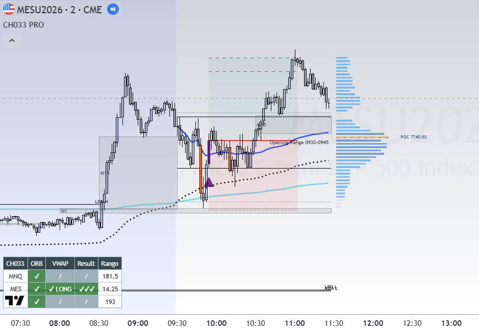

# CH033 ORB+ — Opening Range Manipulation System

A Pine Script v6 trading system for CME index futures, built around a single
setup: the market breaks the New York opening range, fails, and reverses through
session VWAP.

Three files: the full indicator, a stripped backtest strategy, and a VWAP-focused
variant.



*MES, 2-minute, 19 Aug 2026. The complete sequence in one frame: the 09:30-09:45
opening range forms (red box), price sweeps the low, returns inside, then closes
back above session VWAP - the entry, marked by the triangle. Price expands to the
upside for the rest of the morning. The panel in the lower left reports the day
across three instruments at once; MES shows `LONG` reaching the third target.*

---

## The setup

The system trades the *failure* of an opening range break, not the break itself.

1. The first 15-minute candle of the New York session (09:30–09:45 ET) defines a
   high and a low.
2. Price **breaks** one side. Wick or close both count. The candle is marked.
   **No entry yet** — this is only the first condition.
3. Price **returns inside** the range. The manipulation is now confirmed.
4. A candle **closes across the NY session VWAP** in the direction *opposite* the
   original break. Here a wick does not count — it must be a close. **This is the
   entry.**

```
Break above  ->  return inside  ->  close below VWAP  =>  SHORT
Break below  ->  return inside  ->  close above VWAP  =>  LONG
```

## Context layers

- **Asia and London highs/lows** drawn as horizontal levels. A level stops
  extending once price sweeps it, so at a glance you can separate liquidity
  already taken from liquidity still resting.
- **Fair Value Gaps** on M15 and H1, drawn as boxes labeled with their timeframe.
  A box starts at the middle candle of the pattern and freezes on first touch,
  by wick or body.

Every block toggles independently from the settings panel.

## Multi-instrument panels

Two on-chart tables cover MNQ, MES and MYM simultaneously:

- **Trend panel** — H1 / M15 / VWAP alignment
- **Setup panel** — break side, current state, range, and result

The result column reports what happened to the day's signal on each instrument
without switching charts:

| Symbol | Meaning |
|---|---|
| ✔ / ✔✔ / ✔✔✔ | reached TP1 (1:1) / TP2 / TP3 |
| ✕ | stopped out before 1:1 |
| … | trade still live |
| = | closed without hitting TP1 or stop |
| / | no entry yet today |

## Files

| File | Purpose |
|---|---|
| `CH033_ORB_PRO.pine` | Full indicator — signals, context, panels |
| `CH033_ORB_STRATEGY.pine` | Same signal engine as a backtestable strategy |
| `CH033_ORB_VWAPs.pine` | VWAP-focused variant |

## About the backtest version

The strategy file is the same signal engine with everything visual removed —
volume profile, FVGs, session levels, multi-instrument panels, decorative VWAPs.
None of those participate in an entry decision, so removing them changes no
signal and makes the backtest run far faster.

It exists to answer one question with numbers instead of opinion: **does the
alignment filter actually help?** Run it with everything off, record the results,
then enable the filter and compare.

**A backtest limitation worth stating plainly:** inside a 2-minute candle there is
no way to know whether the stop or the target was touched first. TradingView
assumes an order and can be wrong. Bar Magnifier (Premium) uses lower-timeframe
data and makes fills substantially more reliable. Commission and slippage must be
set to your broker's real values — without that the results are inflated and
meaningless.

## Stack

Pine Script v6, TradingView. Session VWAP, opening range logic, fair value gaps,
multi-timeframe alignment, multi-symbol `request.security` panels.

---

*Signal engine written from scratch; the automatic VWAP structure is adapted from
the ASFX approach.*

**Not financial advice.** This is a personal tool published as a code sample.
